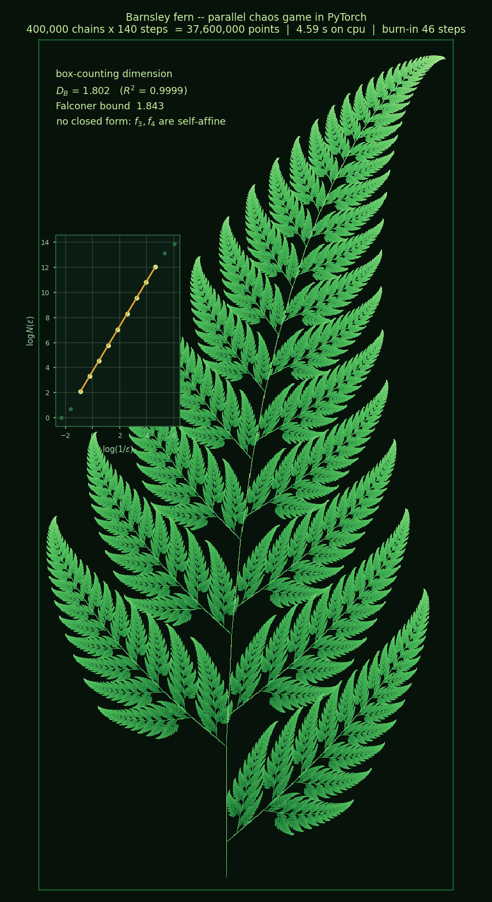

# Barnsley's Fern — an IFS attractor computed in parallel with PyTorch

COMP3710 Pattern Analysis, Lab 1 Part 3 (s4984244, The University of Queensland).

A GPU implementation of the **chaos game** for affine iterated function
systems, plus a validated **box-counting dimension** estimator and a
probability-free **deterministic ε-net** algorithm used to cross-check it.



## Why this fractal

Parts 1 and 2 of the lab cover escape-time fractals in the complex plane
(Mandelbrot, Julia). An IFS attractor is built by a completely different
mechanism, which is what the lab sheet asks for:

| | escape-time (Parts 1–2) | IFS (this repo) |
|---|---|---|
| what is iterated | a value `z` at a **fixed pixel** | a **point**, which moves |
| the unknown | per-pixel escape count | where the points accumulate |
| the fractal is | the set of non-escaping `c` | the **attractor** of a contraction |
| randomness | none | the chaos game picks a map at random |
| numerics | fails at deep zoom (float32 ~1e-7) | self-correcting; error is contracted away |

## The system

Barnsley's fern is four affine maps `f_i(v) = A_i v + b_i`:

```
  map      p     σ₁       σ₂       det     kind
  f₁     0.010  0.1600   0.0000   0.0000   SINGULAR (rank 1) — the stem
  f₂     0.850  0.8509   0.8509   0.7241   similarity — the whole fern, smaller
  f₃     0.070  0.3407   0.3047   0.1038   self-affine — left leaflet
  f₄     0.070  0.3792   0.2870  -0.1088   self-affine, flips orientation
  Lipschitz constant L = max σ₁ = 0.8509
```

`fern = f₁(fern) ∪ f₂(fern) ∪ f₃(fern) ∪ f₄(fern)` — the attractor is the
unique fixed point of that union (the Hutchinson operator), which is a
contraction on compact sets under the Hausdorff metric.

## How the parallelism works

The textbook chaos game is *sequential*: one point, iterated millions of times.
That is the worst possible shape for a GPU. This implementation runs **N
independent chains in lock-step** instead:

```python
u   = torch.rand(n_points)                       # one die roll per chain
idx = torch.searchsorted(cdf, u)                 # vectorised map selection
pts = torch.einsum("nij,nj->ni", A[idx], pts) + b[idx]   # N mat-vecs, one op
hist += torch.bincount(iy * W + ix, minlength=H * W)     # GPU histogram
```

There is no Python loop over points and no data-dependent branch anywhere in
the inner loop. The step count is ~100 regardless of N, so the whole render is
about 100 kernel launches.

This is legitimate because the attractor is the unique fixed point of a
contraction: the chaos game converges from *any* starting point, so every chain
forgets its random initial condition at a geometric rate. Two ensembles started
from different clouds and driven by the same map sequence separate by at most
`L^k`; at `L = 0.851` that falls below one pixel after 46 steps, which is how
the burn-in is chosen (`IFS.burn_in_for`). See `out/part3_burnin.png`.

## Fractal dimension

Box counting is done entirely with tensor ops: rasterise once into a boolean
occupancy grid, then obtain every coarser scale by reshaping into blocks and
reducing with `any`, so the multi-scale sweep costs about one pass.

The estimator is **validated on three systems with a known answer before being
used on the fern**:

| set | measured `D_B` | exact | error |
|---|---|---|---|
| Cantor dust | 1.266 | log 4 / log 3 = 1.2619 | 0.3 % |
| Sierpinski triangle | 1.606 | log 3 / log 2 = 1.5850 | 1.4 % |
| Filled square | 2.000 | 2 | 0.02 % |
| **Barnsley fern** | **≈ 1.80** | no closed form | — |

The fern has no Moran solution because `f₃` and `f₄` are self-affine rather
than similarities. The relevant generalisation is **Falconer's affinity
dimension**, from the singular value function `φˢ(A) = σ₁ σ₂^(s-1)`:
solving `Σᵢ φˢ(Aᵢ) = 1` gives **1.8433**, an upper bound for the box dimension.
Refining the deterministic ε-net drives the measurement up towards it:

| ε | depth | points | `D_B` |
|---|---|---|---|
| 0.05 | 34 | 0.2 M | 1.609 |
| 0.02 | 40 | 1.3 M | 1.741 |
| 0.01 | 44 | 5.3 M | 1.806 |
| 0.005 | 48 | 21.6 M | 1.817 |

`IFS.affinity_dimension()` reduces to Moran's equation when every map is a
similarity, which is why it returns the exact values for the three controls.

## Files

| file | contents |
|---|---|
| `part3_ifs.py` | `IFS` dataclass and diagnostics, `chaos_game`, `deterministic_net`, `box_count`, `fit_dimension`, `hutchinson` |
| `part3_figures.py` | produces every figure and `out/part3_results.json` |
| `part3_dimension.py` | standalone dimension analysis; prints the full report to stdout |
| `slurm/job_part3.sh` | A100 job for Rangpur |
| `AI_PROMPTS.md` | AI interaction log required by the lab sheet |

## Figures

| file | what it answers |
|---|---|
| `part3_fern.png` | the deliverable |
| `part3_maps.png` | how the fractal is formed — points coloured by which `fᵢ` placed them |
| `part3_burnin.png` | why running N chains in parallel is legitimate |
| `part3_boxcount.png` | dimension, with the estimator validated on known cases first |
| `part3_net.png` | probability-free dimension via the deterministic ε-net |
| `part3_probs.png` | the probabilities are importance sampling, not part of the fractal |
| `part3_deterministic.png` | the same attractor with no randomness at all (Banach) |
| `part3_variants.png` | a whole plant stored in 24 numbers — fractal compression |
| `part3_scaling.png` | throughput vs N; evidence the device is actually saturated |

## Running

```bash
python part3_dimension.py --scale small      # dimension report to stdout, ~1 min
python part3_figures.py   --scale small      # all figures, CPU sanity check, ~3 min
python part3_figures.py   --scale full       # A100, ~10 min
```

The dimension is reported in three places, so it is visible without opening
anything: annotated directly onto `part3_fern.png` with an inset of the
box-counting fit, printed by `part3_dimension.py`, and stored in
`out/part3_results.json`.

On Rangpur:

```bash
mkdir -p ~/barnsley-fern-pytorch/logs ~/barnsley-fern-pytorch/out
cd ~/barnsley-fern-pytorch && sbatch slurm/job_part3.sh
squeue --me
```

Falls back to CPU automatically when `torch.cuda.is_available()` is false.

## References

- M. Barnsley, *Fractals Everywhere*, Academic Press, 1988.
- J. Hutchinson, "Fractals and self similarity", *Indiana Univ. Math. J.* 30
  (1981) 713–747.
- K. Falconer, "The Hausdorff dimension of self-affine fractals", *Math. Proc.
  Camb. Phil. Soc.* 103 (1988) 339–350.
- P. Moran, "Additive functions of intervals and Hausdorff measure", *Proc.
  Camb. Phil. Soc.* 42 (1946) 15–23.
- H.-O. Peitgen, H. Jürgens, D. Saupe, *Fractals for the Classroom*, ch. 6
  (The Chaos Game), Springer, 1992.
